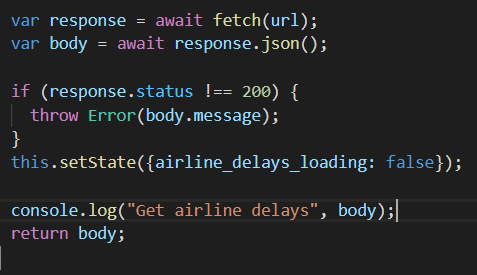

<code>&nbsp;</code>    

  

 

 <h1>COMP3033 Software Quality Assurance 
     Workshop 03 Report
 </h1>

 <h2> Group F </h2>

 <h4> Module convenor: Dr. Radu Muschevici 
      Chosen Option: MariaDB Project, Flights 
      Hosted domain:  
      Due Date: 31 December 2020 
      GitHub Repositories: https://github.com/Kellieys/sqa_cw3 
</h4>

 

| Name (OWA) | Student ID |
| :------- | ----: | 
| Lim Kelly | 20024694 |
| Lee Ze-Cong (efyzl1) | 20006942 |
| Yap Jun Kiat (hcyjy2) | 20093907 |
| Ling Kuok Ging (hfykl3) | 20035543 |
| Raveen A/L Pandian (kefey6rpp) | 18024425 |

  

---

## 2.1 Unit Testing
### 2.1.1 Functional and Structure (White Box)

 
Test Case 1:

Input Origin

if (handleOriginChange) { 
console.log("this.state.selectedOriginOption)} 
 

 
Test Case 2:

Input Destination

if (handleDestinationChange) { 
console.log("this.state.selectedDestinationOption)} 
 

 
Test Case 3:

 Input Airline

if (handleAirlineChange) { 
console.log("this.state.selectedAirlineOption)} 
 

 
Test Case 4:

Input From

if (handleYearFromChange) { 
console.log("this.state.selectedYearFromOption)} 
 

 
Test Case 5:

Input To

if (handleYearToChange) { 
console.log("this.state.selectedYearToOption)} 
 

 
Test Case 6:

Input Month

if (handleMonthChange) { 
console.log("this.state.selectedMonthOption)} 
 

 
Test Case 7:

Input Day

if (handleDayChange) { 
console.log("this.state.selectedDayOption)} 
 

| ID | Test Item | Scenario | Input | Expected Output | Test Factor | Pass or Fail |
| :------- | ----: | ----: | ----: | ----: | ----: | ----: |
| 1 | Input Origin | Test Case 1 | onClick | Console log "state" of current user's input | Correctness | Pass |
| 2 | Input Destination | Test Case 2 | onClick | Console log "state" of current user's input | Correctness |Pass |
| 3 | Input Airline | Test Case 3 | OnClick |Console log "state" of current user's input | Correctness | Pass |
| 4 | Input From | Test Case 4 |onClick |Console log "state" of current user's input | Correctness | Pass |
| 5 | Input To | Test Case 5 | OnClick | Console log "state" of current user's input | Correctness | Pass |
| 6 | Input Month | Test Case 6 | OnClick | Console log "state" of current user's input | Correctness | Pass |
| 7 | Input Day | Test Case 7 | OnClick | Console log "state" of current user's input| Correctness | Pass |

 
<h3>Results of test cases:</h3>
Test case 1: 
 
 Test case 2:
 
 Test case 3:
 
 Test case 4:
 
 Test case 5:
 
 Test case 6:
 
 Test case 7:
 

## 2.2 Integration Testing 
### 2.2.1 Size & Entity (White Box)

 
Test Case 1:

Launch website

if (connection successful) { 
console.log("Get all airlines",body) } 
 

 
Test Case 2:

Launch website

if (connection successful) { 
console.log("Get all airports",body) } 
 

 
Test case 3:

Input search query and click on search button

if (connection successful) { 
console.log("Search button clicked",body) } 
 

 
Test Case 4:

After clicking on the search button

if (connection successful) { 
console.log("Get flights stats", body) } 
 

 
Test Case 5:

After clicking on the search button

if (connection successful) { 
console.log("Get airline delays", body) } 
 

 
Test Case 6:

After clicking on the search button

if (connection successful) { 
console.log("Get airline delays", body) } 
 

| ID | Test Items | Secnario | Input | Expexted Outcome | Test Factor | Pass or Fail
| :------- | ----: | ----: | ----: | ----: | ----: | ----: |
| 1 | Check the connection with database(Airports' data) | Test Case 1 | http://172.104.176.214:3000/ | Console log "Get all airports" and all airports | Correctness | Pass |
| 2 | Check the connection with database(Airlines' data) | Test Case 2 | http://172.104.176.214:3000/ | Console log "Get all airlines" and all airlines | Correctness|Pass |
| 3 | Obtain user inputs | Test Case 3 | onClick | Console log "Search button clicked" and all user inputs| Correctness|Pass |
| 4 | Get Flights' stats | Test Case 4 | onClick | Console log "Get flights stats" and all related flights' stats| Correctness|Pass |
| 5 | Get airline delays | Test Case 5 | onClick | Console log "Get airline delays" and all related airline delays | Correctness|Pass |
| 6 | Get delays comparison | Test Case 6 | onClick | Console log "Get delays comparison" and all related delays comparison | Correctness|Pass |

 
<h3>Results of test cases:</h3>
Test case 1: 
 
 Test case 2:
 
 Test case 3:
 
 Test case 4:
 
 Test case 5:
 
 Test case 6:
 

 
<h3>Conclusion of integration testing:</h3>
The outputs of the console log matched with the expected output, therefore all of the test cases regarding the integration testing have passed the test. Regarding bugs discovered, there were no bugs discovered during this integration testing as none of the test cases failed.