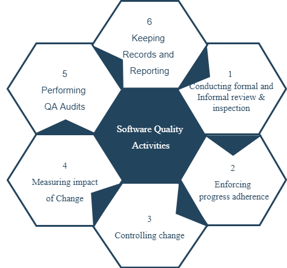

<code>&nbsp;</code>    

  

 

 <h1>COMP3033 Software Quality Assurance 
     Workshop 03 Report
 </h1>

 <h2> Group F </h2>

 <h4> Module convenor: Dr. Radu Muschevici 
      Chosen Option: MariaDB Project, Flights 
      Hosted domain: <a>http://172.104.176.214:3000/</a> 
      Due Date: 12 November 2020 
      Word count: 2909 (Excluding titles) 
</h4>

 

| Name (OWA) | Student ID |
| :------- | ----: | 
| Lim Kelly | 20024694 |
| Lee Ze-Cong (efyzl1) | 20006942 |
| Yap Jun Kiat (hcyjy2) | 20093907 |
| Ling Kuok Ging (hfykl3) | 20035543 |
| Raveen A/L Pandian (kefey6rpp) | 18024425 |

  

---
 

 <h2> 1. Software Quality Factors and Metrics</h2>

 

### McCall's Factor Model
In this section, the report will focuses on the design of test case and scenario. In order to evaluate and improve the software, the testing strategies and techniques that will be execute in the next stage are documented as below. The main testing direction will be a narrow-to-broader, bottom-to-top scope. Figure 1 below illustrate how such testing deisgn can be achieve by unit testing, integration testing and system testing. The objective of these testing are evaluate and examine the software quality factors of Flights according to the McCall's Model, hence, accesing the correctness, realiability, efficiency, integrity, usablity, maintainability, flexibility, testability, protability, resuability and interoperability of the software. 

  
  
    <h4>Figure 1.1: Testing strategies</h4>

### Metrics
#### Halstead Metrics
Halstead metrics was introduced and developed by Maurice Halstead in 1977. It is one of the oldest measures of program complexity and often used to measure the maintenance metric. Halstead's metrics interprets a software's source code as a sequence of tokens and it classifies each of them to be an operator or operand. 

Where operator could be the storage class specifiers (i.e. static, auto, etc.), type qualifiers (i.e. const), reserved words from programming languages (i.e. break, default, public, etc.), or simply mathematical and logical operators(i.e. +, -, &&, etc.) . On the other hand, operands could be the identifiers (i.e. variable names), type specifiers (i.e. Boolean, integer, etc.) or a constant number of character. 

The token is counted as: 

- $n_1$ - number of unique operators
- $n_2$ - number of unique operands
- $N_1$ - total number of operators
- $N_2$ - total number of operands

Following are Halstead metrics that are derived from these quantities with brief description and fixed formulas: 

**Program Length ($N$)**

The program length measures the sum of the total number of operators and operands.

${\displaystyle N=N_{1}+N_{2}\,}$

**Vocabulary Size ($n$)**

The vocabulary size measures the sum of the total number of unique operators and operands. 

${\displaystyle \eta =\eta _{1}+\eta _{2}\,}$

**Program Volume ($V$)**

The program volume measures the size of the implementation of an algorithm. It focuses more on the number of operations performed and operands handled in the algorithm, making it less sensitive to code layout. 

${\displaystyle V=N\times \log _{2}\eta }$

**Difficulty Level ($D$)**

The difficulty level measures the error proneness of the program. It is proportional to the number of unique operators and also between total number of operands and the number of unique operands. 

${\displaystyle D={\eta *{1} \over 2}\times {N*{2} \over \eta _{2}}}$

**Program Level ($L$)**

The program level measures the opposite or inverse of error proneness. 

$L = {1 \over D}$

**Effort to implement ($E$)**
The 'effort to implement' metric measures the effort required to understand the program. It is proportional to the volume($V$) and difficulty level($D$) of the program. 

$E = {V \times D}$

**Time to implement ($T$)**

The 'time to implement' metric measures the approximate of time to implemented the program. It is proportional to effort ($E$).

${\displaystyle T={E \over 18}}seconds $

**Number of delivered bugs ($B$)**

The 'number of delivered bugs' metric measures approximate number of errors in implementation and the overall complexity of the software. 

${\displaystyle B={E^{2 \over 3} \over 3000}}$ OR ${\displaystyle B={V \over 3000}}$
 
### Plato

Plato is a software complexity analysis tool specifically for JavaScript projects. It generates a report based on the complexity data from a library called escomplex. Behind this library, it calculates both Halstead's metrics and McCabe's Cyclomatic complexity. However, it is important to interpret the report produced by these tools in a mindful manner. It helps to identify certain areas of code that contains unknown bugs or inefficiencies and helps to visualise the complexity distributed across on each function or the whole project.

The following are metrics produced by plato on the client application. 

**Maintainability Score**

The maintainability score considers the Halstead volume, cyclomatic complexity, and the line count for each source file.

    <h4>Figure 1.2: Maintainability</h4>

**Lines of Code**

The lines of code graph helps identify large files, which are typically indicative of code that should be broken down or simplified.

    <h4>Figure 1.3: Lines of Code</h4>

 

Total Lines of Code for Client = 762

Total Lines of Code for API = 288

Adding both LOC from Client and API = 1050 lines of code

**Estimated Error Count**

This number is calculated using the Halstead-delivered bug score.

    <h4>Figure 1.4: Errors in implementation</h4> 

 

    <h3>Summary</h3>

|Files|Complexity|Lines Of Code|Est. Errors|
|:---:|:---:|:---:|:---:|
|index.js|1|12|0.05|
|App.js|1|17|0.03|
|Dashboard.js|4|60|0.32|
|AirlineFlightsInfo.js|18|249|1.85|
|AirlinesFlightsInfo.js|12|136|1.11|
|FlightPlanHeader.js|3|29|0.14|
|FlightsFilter.js|8|259|2.80|

 

    <h3>External Matrix</h3>

****HTTP Requests of Flights Application****

| MIME Type | Requests |
| :---: | :---: |
| js | 41 |
| html | 23 |
| image | 10 |
| other | 10 |
| font | 4 |
| css | 2 |

 

---

 <h2> 2. Software Quality Activities</h2>

### Quality Management Plan 

 <h3>Project Quality Measurement</h3>

 | Key Measurement | Description |
 | :------- | ----: |
 | Product Issues | Database has too many data and slow down searching efficiency. |
 | Performance | Flight project should show details data when user input data and search. |

 

  <h3>Key Responsibility</h3>

 | Name | Role | Key Responsibility |
 | :------- | ----: | ----: |
 | Lim Kelly | Group Leader | Unit Tests, System Tests, Validation |
 | Ling Kuok Ging | Team Member | Integration Tests |
 | Lee Ze-Cong| Team Member | Integration Tests, System Tests | 
 | Raveen | Team Member | UI/UX Tests |
 | Yap Jun Kiat | Team Member | UI/UX Tests|

 

 <h3> Implementation Checklist </h3>

 | Checkist | State |
 | :------- | ----: |
 | Has the software meet the requirements? | TBD |
 | Are test unit being used in the code ? | True |
 | Has the maintaining responsibilities delegate all the members ? | True |
 | Has mobile view been tested? | TBD |

   

   <h3>Activities Descriptions</h3>
    

 

  
  <h4>Figure 2.1: Software Quality Activities </h4>

 

 <h3> 2.1 Conducting formal and informal review and inspection</h3>
 
The main purpose of formal review is to gain consensus and detect possible defects in Flight Project. Flights project should meet the functional and non-functional requirements, such as display analytics and infromation based on input. Besides, Flight project also shall display error messages if the required fields are empty. 

 <h3> Enforcing progress adherence </h3>
 
•	Product Evaluation
    - Flight project allows user to choose the departure airport, destination airport, departure time and date.
    - Flight project allows user to search the airport by its short-form name and art of the name. E.g. user can search Phoenix Sky Harbor International Airport by searching Phoenix. 
    - There is a table to show flight details and users can sort the table by Airline name.
    - There is a delay chart for user to know the delay time and delay type.

 •	Process Monitoring 
    Testing techniques such as black box and white box testing are taking part in this session to make sure the correct steps are being implemented and the code is running in the way how it should be. 

 

 <h3> Controlling changes</h3>

 
During development and maintenance phases, by applying changes to Flight project, we are changing the code but controlling the change effect, to ensure Flight project maintain its quality. 
 

 <h3> Measuring impact of change </h3>

 
When a bug or defect is detected in the Flight project, change is required to perform the fix. The impact of change is measured to determine how significant was the change and how it affected the project. It is also required to check if the Flight project is compatabile with the new change after fixing the defects.

 <h3> Performing QA audits </h3>

 
Performing SQA audits ensures that the Flight project adheres to the defined standards and procedures. It also makes sure that the requirements of the Flight project are met. If the quality standards or the requirements are not met, it will be reflected to the development team to make changes accordingly.

 <h3> Keeping records and reporting </h3>

 
Keeping records and reporting ensures that the Flight project has all the necessary documents for future reference, and the documents recorded are also shared with the stakeholders. The documents are also extremely useful in case something went wrong in the Flight project, the development team can look at the documentation and figure out what is the problem. 
 

---

 

 <h2> 3. Software Testing Strategies</h2>

 

### Testing objectives 
#### Testing is an impotant quality control activity. this is to detect and fix defects. The main objectives are to identify and reveal errors or defects and ensure its correctness, completeness of the software and conforming to the requirements.  

  
  
    <h4>Figure 3.1: Flow diagram for process overview </h4>

  

### Software Testing Strategies and Planning

### 3.1 Unit Testing
#### 3.1.1 Functional and Structure (White Box)

<h4> The unit testing concerns with the correctness of individual function and module. In this flight project the unit testing will focuses on three levels:</h4>

#### Input functions:
* Origin
* Destination
* Airiline
* From
* To
* Month
* Day 

<h4> Test Case 1 </h4>

* where x = all IATA code or airport names in database

if (input = x) {
  dropdown = x;
}  
else { dropdown = empty; }

 

<h4> Test Case 2 </h4>

* where z = Click on input field

* where y = empty input

* where x = all IATA code or airport names in database

if ( z = y ) {
  dropdown = x;
}  
else { dropdown = not shown; }

 

<h4> Test Case 3 </h4>

* where x = all IATA code or airline names in database

if (input = x) {
  dropdown = x;
}  
else { dropdown = empty; }

 

<h4> Test Case 4 </h4>

* where z = Click on input field

* where y = empty input

* where x = all IATA code or airline names in database

if ( z = y ) {
  dropdown = x;
}  
else { dropdown = not shown; }

| ID | Test Items | Secnario | Input | Expexted Output | Test Factor | Passs or Fail |
| :------- | ----: | ----: | ----: | ----: | ----: | ----: |
| 1 | Input Origin | Test Case 1 | Chicago O'Hare International Aiport,  ORD, C, c, Chi, chi | Chicago O'Hare International Aiport | Correctness | |
| 2 | Input Destination | Test Case 1 | Wendover Airport, Wen, W, w, we, E, en | Wendover Airport | Correctness | |
| 3 | Input Origin & Destination | Test Case 2 | OnClick | Show all dropdown | Correctness | |
| 4 | Input Airline | Test Case 3 | United Air Lines Inc. U, u, UA, ua  | United Air Lines Inc. | Correctness | |
| 5 | Input Airline | Test Case 4 | OnClick | Show all dropdown | Correctness | |

#### Output functions:
* Search Button
* Sorting Button
* Pie Chart and Bar Graph

<h4> Test Case 1 </h4>

Inspect className="button-search" onClick={this.executeSearch} in FlightFilter.js

<h4> Test Case 2 </h4>

Inspect SortingState component in AirlinesFlightsInfo.js

<h4> Test Case 3 </h4>

Inspect BarChart and PieChart component in AirlineFlightsInfo.js

 

| ID | Test Items | Secnario | Expexted Outcome | Test Factor | Pass or Fail |
| :------- | ----: | ----: | ----: | ----: | ----: | 
| 1 | Search Button's Triggers | Test Case 1 | executeSearch() function is called | Correctness |  |
| 2 | Sorting Button Clickable | Test Case 2 | sortingSaate component is called | Correctness |  |
| 3 | Visibility of Pie Chart and Bar Chart | Test Case 3 | PieChart and BarChart components  | Correctness |  |
| 4 | Data of Pie Chart and Bar Chart | Test Case 3 | PieChart and BarChart components | Correctness |  |

---

### 3.2 Integration Testing 
#### 3.2.1 Size & Entity (White Box)

In this section is to inspect the API level and database level. Such as the connection and communication of API retrieing  the correct data from database according to the input 

<h4> Test Case 1 </h4>

Launch website and establish connection to MariaDB

<h4> Test Case 2 </h4>

Click on "Origin" dropdown menu

<h4> Test Case 3 </h4>

Click on "Destination" dropdown menu

<h4> Test Case 4 </h4>

Click on "Airline" dropdown menu

<h4> Test Case 5 </h4>

Input related data and click on search button

 

| ID | Test Items | Secnario | Input | Expected Outcome | Test Factor | Pass or Fail
| :------- | ----: | ----: | ----: | ----: | ----: | ----: |
| 1 | Check the connection with database | Test Case 1 | http://172.104.176.214:3000/ | Connection is established successfully | Correctness |  |
| 2 | Get Airports data | Test Case 2 | onClick | Display all airports on screen | Correctness|
| 3 | Get Airports data | Test Case 3 | onClick | Display all airports on screen | Correctness|
| 4 | Get Airlines data | Test Case 4 | onClick | Display all airlines on screen | Correctness|
| 5 | Obtain data from user inputs | Test Case 5 | onClick | Display flight's data, graphs and charts related to the user inputs | Correctness|

 

### 3.3 System Testing (Black Box)

 This section will use black box testing to test the system as a whole. The test is is design according to the functional and non-functional requirements that are listed in the appendix section. 

<h4> Mobile Compatibility testing </h4>
<h4> Test Case 1 </h4>

 Background design should align with data input section. 

<h4> Test Case 2 </h4>

 Width of table should align with the user input section. 

<h4> Test Case 3 </h4>

 Graph of delay type and time should be shown clearly.  

 

| ID | Test Item | Scenarios | Input | Expected Output | Test Factor | Pass or Fail|
| :------- | ----: | ----: | ----: | ----: | ----: | ----: |
| 1 | Background design should align with data input section | Test Case 1 | On View | Background design is fixed and smaller than data input section (1). | Correctness |  | 
| 2 | Width of table should align with the user input section. | Test Case 2 | On View | Width of table is following the background design and not align with data input section. | Correctness |  | 
| 3 | Graph of delay type and time should be shown clearly. | Test Case 3 | On View | Showing the graph of delay type or delay time in mobile vertical mode, both graph is overlaying. When using flight project in mobile horizontal mode, the graph is showing fine but are not fitting in the designed box.(2) | Correctness |  | 

---

####  User Experience Testing (UX) 
<h4> Test Case 1 </h4>

 Flight project is a single page webpage, not multiple page webpage. 

<h4> Test case 2 </h4>

 Network Connection is required to use the webpage. 

<h4> Test case 3 </h4>

 Data will be dalay or rong if network connection is unstable or poor.  

 

| ID | Test Item | Scenarios | Input | Expected Output | Test Factor | True or False |
| :------- | ----: | ----: | ----: | ----: | ----: | ----: |
| 1 | Flight project is a single page webpage, not multiple page webpage. | Test case 1 | On View | User doesn't required few webpage to run Flight Project. | Usability |  |
| 2 | Network Connection is required to use the webpage. | Test case 2 | On View | When there's no Internet connection, Flight Project can't be run. | Integrity |  |  
| 3 | Data will be dalay or wrong if network connection is unstable or poor. | Test case 3 | On View | When network is poor, the delay chart will show the wrong data with the airline. | Usability |  | 

 

<h4> Flight Web Interface Testing (GUI) </h4>

<h4> Test Case 1 </h4>

 View Search button alignment with different screen sizes. 

<h4> Test Case 2 </h4>

 Click arrow button to sort the table based on the title. 

<h4> Test Case 3 </h4>

 Text and images resize accordingly when user resize browser. 

<h4> Test Case 4 </h4>

 Select same origin and destination. 

 
<h4> Test Case 5 </h4>

 Hover on Pie or bar chart to view the data in a small box.  

 

| ID | Test Item | Scenarios | Input | Expected Output | Test Factor | Pass or Fail |
| :------- | ----: | ----: | ----: | ----: | ----: | ----: |
| 1 | Search button alignment on screen resizing | Test case 1 | On View | On resize, the search button aligns accordingly | Correctness |  |
| 2 | Click arrow button to sort | Test case 2 | On Click | The data of flights on table, appear in that particular sorting order | Correctness |  |  
| 3 | Text and image size with various  window sizes | Test case 3 | On View | On changing screen size, text and images changes size accordingly | Correctness |  | 
| 4 | Select same destination as origin | Test case 4 | On Click | Error message should pop-up | Correctness |  |
| 5 | Hover mouse over pie chart | Test case 5 | On View | On hovering mouse, the data should display accordingly| Correctness |  | 

---

## Appendix

### 1. Software Requirements
#### Functional Requirements
**FR1** The system shall display analytics that is customized based on the user's input of flight origin, flight destination, airline of the flight, and date of flight.

**FR2** The system shall support inputs that must perform the following searches in each input field: 
- Finding the exact match of the phrase
- Finding the abbreviation of the phrase on input that support it

**FR3** The system shall display "No options" on each input field if the input is not valid

**FR4** The system shall display error messages if the required input fields are empty

**FR5** The system shall perform and display the analytics on the following comparisons:

- Airlines statistics such as total flights, market share, airline delays and more on the same flight route
- Each type of reasoning of flight delay on the selected airline from the airline input field
- Each type of reasoning of flight delay between the selected airline and the average of all airlines

**FR6** User shall be able to sort the comparison table either in an alphabetical order or in a numerical order

#### Non-Functional Requirements
**NFR1** The web application must be accessible in a single window on a computer or mobile device. 

**NFR2** The web application shall only be functional with an internet connection.

**NFR3** The web application shall be run on a relatively new web browser: Chrome 63 or higher, Edge 15 or higher, Firefox 57 or higher, Safari 11 or higher, Mobile Chrome 63 or higher, Mobile Safari 11 or higher

**NFR4** Analytics data shall reflect on the user interface with an average response time that is less than 8 seconds. The maximum response time should not be greater than 20 seconds.

---
 