<code>&nbsp;</code>    

  

 

 <h1>COMP3033 Software Quality Assurance 
     Workshop 03 Report
 </h1>

 <h2> Group F </h2>

 <h4> Module convenor: Dr. Radu Muschevici 
      Chosen Option: MariaDB Project, Flights 
      Hosted domain:  
      Due Date: 31 December 2020 
      GitHub Repositories: https://github.com/Kellieys/sqa_cw3 
</h4>

 

| Name (OWA) | Student ID |
| :------- | ----: | 
| Lim Kelly | 20024694 |
| Lee Ze-Cong (efyzl1) | 20006942 |
| Yap Jun Kiat (hcyjy2) | 20093907 |
| Ling Kuok Ging (hfykl3) | 20035543 |
| Raveen A/L Pandian (kefey6rpp) | 18024425 |

  

---

## 2.1 Unit Testing
### 2.1.1 Functional and Structure (White Box)

#### Input functions;

 
Test Case 1:

Input Origin

if (handleOriginChange) { 
console.log("this.state.selectedOriginOption)} 
 

 
Test Case 2:

Input Destination

if (handleDestinationChange) { 
console.log("this.state.selectedDestinationOption)} 
 

 
Test Case 3:

 Input Airline

if (handleAirlineChange) { 
console.log("this.state.selectedAirlineOption)} 
 

 
Test Case 4:

Input From

if (handleYearFromChange) { 
console.log("this.state.selectedYearFromOption)} 
 

 
Test Case 5:

Input To

if (handleYearToChange) { 
console.log("this.state.selectedYearToOption)} 
 

 
Test Case 6:

Input Month

if (handleMonthChange) { 
console.log("this.state.selectedMonthOption)} 
 

 
Test Case 7:

Input Day

if (handleDayChange) { 
console.log("this.state.selectedDayOption)} 
 

| ID | Test Item | Scenario | Input | Expected Output | Test Factor | Pass or Fail |
| :------- | ----: | ----: | ----: | ----: | ----: | ----: |
| 1 | Input Origin | Test Case 1 | onClick | Console log "state" of current user's input | Correctness | Pass |
| 2 | Input Destination | Test Case 2 | onClick | Console log "state" of current user's input | Correctness |Pass |
| 3 | Input Airline | Test Case 3 | OnClick |Console log "state" of current user's input | Correctness | Pass |
| 4 | Input From | Test Case 4 |onClick |Console log "state" of current user's input | Correctness | Pass |
| 5 | Input To | Test Case 5 | OnClick | Console log "state" of current user's input | Correctness | Pass |
| 6 | Input Month | Test Case 6 | OnClick | Console log "state" of current user's input | Correctness | Pass |
| 7 | Input Day | Test Case 7 | OnClick | Console log "state" of current user's input| Correctness | Pass |

 
<h3>Results of test cases:</h3>
Test case 1: 
 
 Test case 2:
 
 Test case 3:
 
 Test case 4:
 
 Test case 5:
 
 Test case 6:
 
 Test case 7:
 

 

#### Output functions;

 
Test Case 1:

 Search Button

Using JEST testing library 
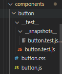 
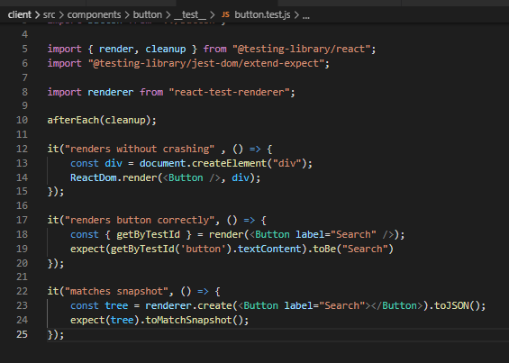 

 
Test Case 2:

Output table

Console the data that will be reflect in the data 
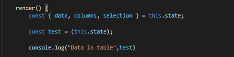 

 
Test Case 3:

 Render and data of Pie Chart and Bar Chart 

Added testVisibility state and called in PieChart and BarChart components to test. 

Added state

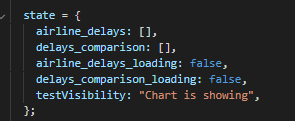 

Console in PieChart Component

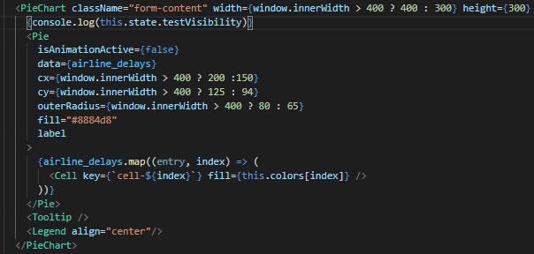 

Console in Bar Chart Component

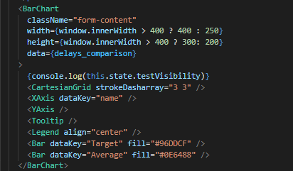 

| ID | Test Item | Scenario | Input | Expected Outcome | Test Factor | Pass or Fail |
| :------- | ----: | ----: | ----: | ----: | ----: | ----: |
| 1 | Search Button | Test Case 1 | Run npm test | Jest testing library Pass | Correctness | Pass  |
| 2 | Output table | Test Case 2 | N/A | Console log "Data in table"  | Correctness | Pass |
| 3 | Render of Pie Chart and Bar Chart | Test Case 3 | N/A | Console log "Chart is showing" | Correctness | Pass  |
| 4 | Data of Pie Chart and Bar Chart | Test Case 3 | N/A | Console log "Chart is showing" | Correctness | Pass |

 
<h3>Results of test cases:</h3>
Test case 1: 
Result of JEST
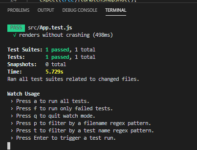 
Snapshot generated by JEST
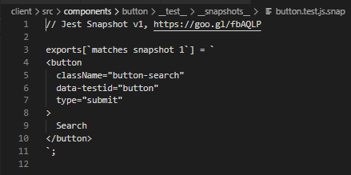 
 Test case 2:
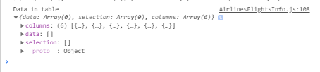 
 Test case 3 and 4:
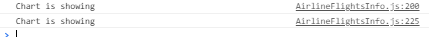 

 
<h3>Conclusion of unit testing:</h3>
All of the test case in unit testing had passed the test case individually which means that in the integration testing, where each unit merge together, there should be no issue with the invidually components. If there are problem found in integration testing, it will most likelty be the issue of merging the individual component.

## 2.2 Integration Testing 
### 2.2.1 Size & Entity (White Box)

 
Test Case 1:

Launch website

if (connection successful) { 
console.log("Get all airlines",body) } 
 

 
Test Case 2:

Launch website

if (connection successful) { 
console.log("Get all airports",body) } 
 

 
Test case 3:

Input search query and click on search button

if (connection successful) { 
console.log("Search button clicked",body) } 
 

 
Test Case 4:

After clicking on the search button

if (connection successful) { 
console.log("Get flights stats", body) } 
 

 
Test Case 5:

After clicking on the search button

if (connection successful) { 
console.log("Get airline delays", body) } 
 

 
Test Case 6:

After clicking on the search button

if (connection successful) { 
console.log("Get airline delays", body) } 
 

| ID | Test Items | Secnario | Input | Expexted Outcome | Test Factor | Pass or Fail
| :------- | ----: | ----: | ----: | ----: | ----: | ----: |
| 1 | Check the connection with database(Airports' data) | Test Case 1 | http://172.104.176.214:3000/ | Console log "Get all airports" and all airports | Correctness | Pass |
| 2 | Check the connection with database(Airlines' data) | Test Case 2 | http://172.104.176.214:3000/ | Console log "Get all airlines" and all airlines | Correctness|Pass |
| 3 | Obtain user inputs | Test Case 3 | onClick | Console log "Search button clicked" and all user inputs| Correctness|Pass |
| 4 | Get Flights' stats | Test Case 4 | onClick | Console log "Get flights stats" and all related flights' stats| Correctness|Pass |
| 5 | Get airline delays | Test Case 5 | onClick | Console log "Get airline delays" and all related airline delays | Correctness|Pass |
| 6 | Get delays comparison | Test Case 6 | onClick | Console log "Get delays comparison" and all related delays comparison | Correctness|Pass |

 
<h3>Results of test cases:</h3>
Test case 1: 
 
 Test case 2:
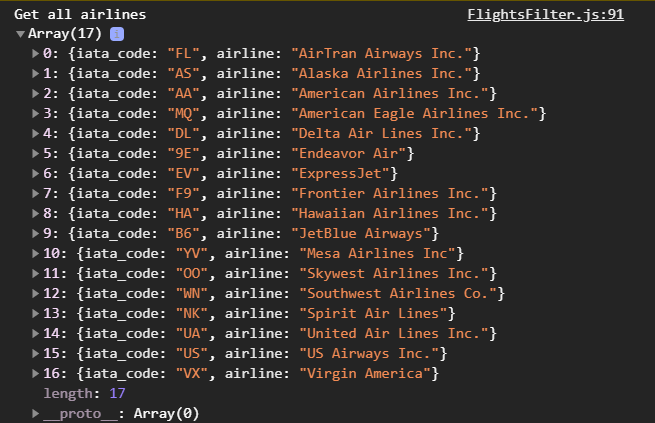 
 Test case 3:
 
 Test case 4:
 
 Test case 5:
 
 Test case 6:
 

 
<h3>Conclusion of integration testing:</h3>
The outputs of the console log matched with the expected output, therefore all of the test cases regarding the integration testing have passed the test. Regarding bugs discovered, there were no bugs discovered during this integration testing as none of the test cases failed.

 

## 2.3 GUI Testing (Black box)
### 2.3.1 Mobile Compatibility Testing
 
<h4> Test Case 1 </h4>

 Background design should align with data input section. 

 

<h4> Test case 2 </h4>

 Width of table should align with the user input section. 

 

<h4> Test case 3 </h4>

 Graph of delay type and time should be shown clearly.  

 

| ID | Test Item | Scenarios | Input | Expected Output | Test Factor | Pass or Fail|
| :------- | ----: | ----: | ----: | ----: | ----: | ----: |
| 1 | Background design should align with data input section | Test Case 1 | N/A | Background design is fixed and smaller than data input section. | Correctness | Fail | 
| 2 | Width of table should align with the user input section. | Test Case 2 | N/A | Width of table is following the background design and not align with data input section. | Correctness | Fail | 
| 3 | Graph of delay type and time should be shown clearly. | Test Case 3 | N/A | Showing the graph of delay type or delay time in mobile vertical mode, both graph is overlaying. When using flight project in mobile horizontal mode, the graph is showing fine but are not fitting in the designed box. | Usability | Fail | 

 
<h3>Result of Test Case</h3>

<h4>Test Case 1</h4>

<h5>Initial Software (Before)</h5>

 

<h5>Improved software (After)</h5>

<h4>Test Case 2</h4>

<h5>Initial Software (Before)</h5>

 

<h5>Improved software (After)</h5>

 

<h4>Test Case 3</h4>

<h5>Initial Software (Before)</h5>

 

 
<h5>Improved software (After)</h5>

 
<h4>Conclusion</h4>

All of the test case failed the test. Based on that we can tell that this software is not well designed for mobile devices. No bugs were found during the testing process. 

 

### 2.3.2 User Experience Testing
 
<h4> Test Case 1 </h4>

 Flight project is a single page webpage, not multiple page webpage. 

 

<h4> Test case 2 </h4>

 Network Connection is required to use the webpage. 

 

<h4> Test case 3 </h4>

 Data will be dalay or rong if network connection is unstable or poor.  

 

<h4> Test case 4 </h4>

 Database need to be connected to show data. 

 

| ID | Test Item | Scenarios | Input | Expected Output | Test Factor | True or False |
| :------- | ----: | ----: | ----: | ----: | ----: | ----: |
| 1 | Flight project is a single page webpage, not multiple page webpage. | Test case 1 | N/A | User doesn't required few webpage to run Flight Project. | Portability | True |
| 2 | Network Connection is required to use the webpage. | Test case 2 | N/A | When there's no Internet connection, Flight Project can't be run. | Integrity | True |  
| 3 | Data will be dalay or wrong if network connection is unstable or poor. | Test case 3 | N/A | When network is poor, the delay chart will show the wrong data with the airline. | Reliability | True | 
| 4 | Database need to be connected for Flight project to show the data | Test case 4 | N/A | When database is not connected, Flight project will unable to show any data when user choose the dropdown section. | Maintainability | True |
  

<h3>Result of Test Case</h3>
 

<h4>Test Case 1</h4>

After testing, we found out that the project only has one page, even when we press search, it still remain on the initial page and show the result on the initial page.

<h4>Test Case 2</h4>

The testing was pass for this test case that it required Internet connection to run this project. When we disconnect the Internet connection, we are unable to connect to the project. 

 

<h4>Test Case 3</h4>

After testing, we found out that when the connection is bad, if we change the data too fast, the data will delay and couldn't catch up with the input that we insert.

<h4>Test Case 4</h4>

During the testing section, we found out that the dropdown section is blank if we didn't connect to the database.

 
<h4>Conclusion</h4>

The testing was meet our expected output. Hence, all the testing were pass. Regarding bugs testing, there aren't any bugs were found in this project. 

### 2.3.3 Interface Features Testing (GUI) 
 
<h5> Test Case 1 </h5>

 View Search button alignment with different screen sizes. 

 

<h5> Test case 2 </h5>

 Click arrow button to sort the table based on the title. 

 

<h5> Test case 3 </h5>

 Text and images resize accordingly when user resize browser. 

 

<h5> Test case 4 </h5>

 Select same origin and destination. 

 
 
<h5> Test case 5 </h5>

 Hover on Pie or bar chart to view the data in a small box.  

 

| ID | Test Item | Scenarios | Input | Expected Output | Test Factor | Pass or Fail |
| :------- | ----: | ----: | ----: | ----: | ----: | ----: |
| 1 | Search button alignment on screen resizing | Test case 1 | N/A | On resize, the search button aligns accordingly | Correctness | Fail |
| 2 | Click arrow button to sort | Test case 2 | On Click | The data of flights on table, appear in that particular sorting order | Correctness | Pass |  
| 3 | Text and image size with various  window sizes | Test case 3 | N/A | On changing screen size, text and images changes size accordingly | Correctness | Fail | 
| 4 | Select same destination as origin | Test case 4 | On Click | Error message should pop-up | Correctness | Fail |
| 5 | Hover mouse over pie chart | Test case 5 | N/A | On hovering mouse, the data should display accordingly| Correctness | Pass | 
 

<h3>Result of Test Case</h3>
 

<h4>Test Case 1</h4>

<h5>Initial Software (Before)</h5>

 

<h5>Improved software (After)</h5>

<h4>Test Case 2</h4>

<h5>Before Sorting</h5>
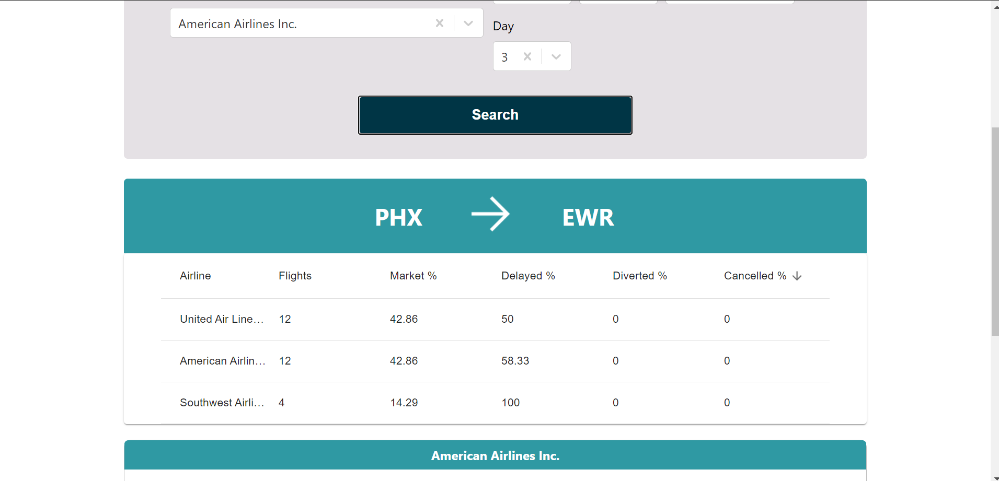
 

<h5>After Sorting</h5>
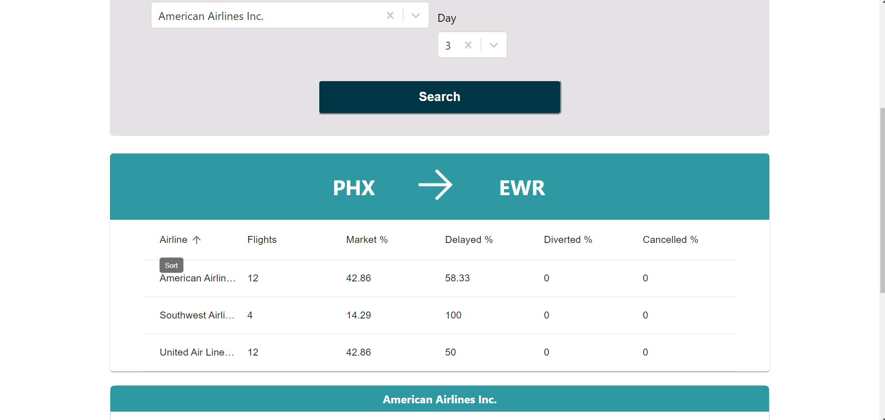
 

<h4>Test Case 3</h4>

<h5>Initial Software (Before)</h5>

 

<h5>Improved software (After)</h5>

<h4>Test Case 4</h4>

When 2 same destination and origin were choose, no data will be shown. 

 

<h4>Test Case 5</h4>

When mouse is hover over pie chart, chart details will be shown.

 

### 2.3.4 Bug found 
 

If the user click the search button without inputing the required field eg: origin,destination and time, error message will pop out. It clearly shows that the website is not doing error handling.

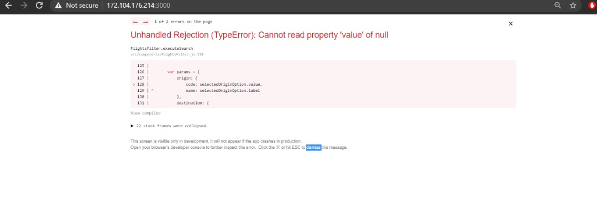

<h4>Conclusion</h4>

2 out of 5 test case pass the testing and 3 of it failed for the GUI testing part. Regarding the bugs test, there is a bug that we found which mentioned above. 
