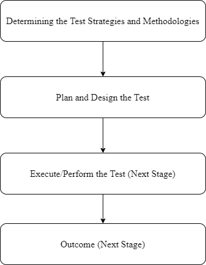

<code>&nbsp;</code>    

  

 

 <h1>COMP3033 Software Quality Assurance 
     Workshop 03 Report
 </h1>

 <h2> Group F </h2>

 <h4> Module convenor: Dr. Radu Muschevici 
      Chosen Option: MariaDB Project, Flights 
      Hosted domain: <a>http://172.104.176.214:3000/</a> 
      Due Date: 12 November 2020 
      Word count: 2909 (Excluding titles) 
</h4>

 

| Name (OWA) | Student ID |
| :------- | ----: | 
| Lim Kelly | 20024694 |
| Lee Ze-Cong (efyzl1) | 20006942 |
| Yap Jun Kiat (hcyjy2) | 20093907 |
| Ling Kuok Ging (hfykl3) | 20035543 |
| Raveen A/L Pandian (kefey6rpp) | 18024425 |

  

---
 

 <h2> 1. Software Quality Factors and Metrics</h2>

 

  
<h3> SOFTWARE QUALITY FACTORS </h3>

### McCall's Factor Model
The McCall factor model provides a practical, up-to-date method for classifying software requirements. This model classifies all software requirements into 11 software quality factors. The 11 factors are grouped into three categories – product operation, product revision, and product transition factors.

* ****Product operation factors****: Correctness,Reliability, Efficiency, Integrity, Usability.
* ****Product revision factors****: Maintainability, Flexibility, Testability.
* ****Product transition factors****: Portability, Reusability, Interoperability.

Following are the assessments provided for each quality factor for our project:

### ****1. Correctness****
****Correctness of Data****

Following requirements deal with the correctness of the Flights web application:
* Verify that the application write to the database properly.
* Verify that the application record from the database correctly.
* Verify that the text fields are correctly storing information.
* Verify that the transient data is retained.
* Verify that the requirements for timing out of session are met.

****Correctness of Presentation****
* Check for properly displayed field data.
* Verify that the URL show you are in secure page
* Verify that the interfaces meet current GUI standards
* Check if the page layouts and format based on requirements (e.g., visual highlighting, etc.)

****Correctness of Navigation****
* Verify that the user can correctly navigate to the links.

****Correctness of Functionality****
* Verify error handling.
* Verify internal searches.
* Verify calculations.

#### Reliability
Following requirements deal with the Reliability of the Flights web application:
* Check the failure rate of the application.
* Check the likelihood of defects in the application.

#### Efficiency
Efficiency of the web application can be identified by covering the following aspects:
* User's requirements satisfied by the application.
* The software specifications are achieved by the application.
* How much effort is put in the development of the application.

Another way to calculate efficiency of the application is by using the following formulae:
* Efficiency = (Total number of defects found in unit+integration+system) / (Total number of defects found in unit+integration+system+User acceptance testing)
* Efficiency = (No. of defects Resolved / Total No. of Defects Submitted)* 100

#### Integrity
Integrity of the web application can be achieved by ensuring the following practices:
* Using a coding standard
* Functional and non-functional testing to verify the application's performance.
* Analyzing code to ensure it is effective and free of errors.
* Following code review
* Refactoring legacy code

#### Usability
Following requirements deal with the Usability of the Flights web application:
* Check for the usage of the system to help the user in their flight search.
* Verify if the menus, commands, and screens clear to a typical user.
* Verify if the user procedures simple, logical, and clear to the typical user.
* Verify if the results generated by the application search in order, consistent, and clear.

#### Maintainability
Following requirements deal with the Maintainability of the Flights web application:
* Check the kind of tools that will be available for servicing the system.
* Verify the usage of the tools.

#### Flexibility
Flexibility of the application can be attained by assessing the following metrics:
* Construction time
* Modification time
* Latency
* Dimensionality
* Size
* Cyclomatic Complexity

#### Testability
Testability of the web application can be attained by following:
* Adding explicit unit tests
* Utilizing tools that measure test coverage
* Code reviews
* Use of consistent code style

#### Portability
Following requirements deal with the Portability of the Flights web application: 
* Verifying if the application satisfies the portability requirements.
* Determining the look and feel of the application in the various browser types.
* Reporting the defects to the development teams so that they can be associated and defects can be fixed.

#### Reusability
The system needs to meet the following criteria to assess the Reusability of the application:
* Modularity
* Environment independence
* Code complexity
* Self descriptiveness
* Module complexity
* Reliability
* Error tolerance

#### Interoperability
Interoperability of the web application can be achieved by assessing the following requirements:
* Checking connectivity between devices
* Checking for functionality on different browsers
* If the results are not positive, then use monitor tools to detect source of error

## Metrics

### Direct Metrics
Direct metric is a metric that does not rely upon the measure of any other attribute. It is a functional that have only one variable.

We can apply Direct Metric on our Flights application by calculating it's size in terms of LOC (Lines of Code), and the programming time in terms of person-months.

****Size = 1163 LOC****

****Programming Time = 2 person-months****

### Derived Metrics
Derived Metrics are measured using more than one attributes. It combines a number of measures through a formula. 

We are going to apply Derived Metric on our Flights application by calculating Programmer Productivity.

$Programmer\hspace{0.1cm}Productivity = \frac{LinesOfCode}{ProgrammingTime}$

$Programmer\hspace{0.1cm}Productivity = \frac{1163}{2} = 582 \hspace{0.1cm}LOC/person\hspace{0.1cm}per\hspace{0.1cm}month$

$Module\hspace{0.1cm}Defect\hspace{0.1cm}Density = \frac{NumberOfDefects}{Module Size}$

$Defect\hspace{0.1cm}Detection\hspace{0.1cm}Efficiency=\frac{NumberOfDefectsDetected}{TotalNumberOfDefects}$

### Internal Metrics
****Size of Flights Application****

| Total No. of Lines | LOC | No. of Classes|
| :----: | :---: | :---: |
| 1,326 | 1,163 | 16 |

### External Metrics
****HTTP Requests of Flights Application****

| MIME Type | Requests |
| :---: | :---: |
| js | 41 |
| html | 23 |
| image | 10 |
| other | 10 |
| font | 4 |
| css | 2 |

### Code Size Metrics

### Complexity Metrics
## Function-Oriented Testing

 

---

 <h2> 2. Software Quality Activities</h2>

 #### Measuring impact of change
 When a bug or defect is detected in the Flight project, change is required to perform the fix. The impact of change is measured to determine how significant was the change and how it affected the project. It is also required to check if the Flight project is compatabile with the new change after fixing the defects.

 #### Performing QA audits
 Performing SQA audits ensures that the Flight project adheres to the defined standards and procedures. It also makes sure that the requirements of the Flight project are met. If the quality standards or the requirements are not met, it will be reflected to the development team to make changes accordingly.

 #### Keeping records and reporting
 Keeping records and reporting ensures that the Flight project has all the necessary documents for future reference, and the documents recorded are also shared with the stakeholders. The documents are also extremely useful in case something went wrong in the Flight project, the development team can look at the documentation and figure out what is the problem. 

 

---

 

 <h2> 3. Software Testing Strategies</h2>

 

<h3> 3.1 Testing objectives </h3>

 
Testing is an impotant quality control activity. this is to detect and fix defects. The main objectives are to identify and reveal errors or defects and ensure its correctness, completeness of the software and conforming to the requirements.  

 

<h3> 3.1 Overview of Process</h3>

  
  
    <h4>Figure 3.1 Flow diagram for process overview </h4>

  

<h3>3.2 Software Testing Strategies and Planning</h3>

<h4> 3.2.1 For Entity and Size </h4>
<h4> 3.2.1.1 Unit Testing </h4>

#### The unit testing concerns with the correctness of individual function and module. In this flight project the unit testing will focuses on three levels:

 

#### Input functions:
* Origin
* Destination
* Airiline
* From
* To
* Month
* Day 

 

<h4> 3.2.1.2 Testing Design </h4>
 

Test Case 1:  

* where x = all IATA code or airport names in database

if (input = x) {
  dropdown = x;
}  
else { dropdown = empty; }

 

Test Case 2:  

* where z = Click on input field

* where y = empty input

* where x = all IATA code or airport names in database

if ( z = y ) {
  dropdown = x;
}  
else { dropdown = not shown; }

 

Test Case 3:  

* where x = all IATA code or airline names in database

if (input = x) {
  dropdown = x;
}  
else { dropdown = empty; }

 

Test Case 4:  

* where z = Click on input field

* where y = empty input

* where x = all IATA code or airline names in database

if ( z = y ) {
  dropdown = x;
}  
else { dropdown = not shown; }

 

| ID | Test Items | Secnario | Input | Expexted Output | Test Factor | 
| :------- | ----: | ----: | ----: | ----: | ----: | ----: |
| 1 | Input Origin | Test Case 1 | Chicago O'Hare International Aiport,   ORD, C, c, Chi, chi | Chicago O'Hare International Aiport | Correctness |
| 2 | Input Destination | Test Case 1 | Wendover Airport   Wen, W, w, we, E, en | Wendover Airport | Correctness |
| 3 | Input Origin & Destination | Test Case 2 | OnClick | Show all dropdown | Correctness |
| 4 | Input Airline | Test Case 3 | United Air Lines Inc.   U, u, UA, ua  | United Air Lines Inc. | Correctness |
| 5 | Input Airline | Test Case 4 | OnClick   | Show all dropdown | Correctness |

 

#### Output functions:
* Search Button
* Sorting Button
* Output Pie Chart and Bar Graph

<h4> 3.2.1.2 Testing Design </h4>

 

| ID | Test Items | Secnario | Expexted Outcome | Test Factor | Pass or Fail
| :------- | ----: | ----: | ----: | ----: | ----: | ----: |
| 1 | a | a | a | a | ? |

 

#### API functions:
* Caluclations
* Retrieving from Database

 

 

<h4> 3.1.2 Integration Testing</h4>

testplan

 

| ID | Test Items | Secnario | Expexted Outcome | Test Factor | Pass or Fail
| :------- | ----: | ----: | ----: | ----: | ----: | ----: |
|a | a| a|a |a | ? |

 

<h4> 3.1.3 System Testing</h4>

testplan

 

| ID | Test Items | Secnario | Expexted Outcome | Test Factor | Pass or Fail
| :------- | ----: | ----: | ----: | ----: | ----: | ----: |
|a | a| a|a |a | ? |

<h3> 3.2 For structure & function </h3>

<h4> 3.2.1 Black Box </h4>

• Equivalent Class Partitioning.
• Boundary Values Analysis.

<h4> 3.2.2 White Box </h4>

Testing coverage (line, path…)

 

<h2> 3.x GUI Testing<h2>

 

---
 

## Appendix

### 1. Software Requirements
#### Functional Requirements
**FR1** The system shall display analytics that is customized based on the user's input of flight origin, flight destination, airline of the flight, and date of flight.

**FR2** The system shall support inputs that must perform the following searches in each input field: 
- Finding the exact match of the phrase
- Finding the abbreviation of the phrase on input that support it

**FR3** The system shall display "No options" on each input field if the input is not valid

**FR4** The system shall display error messages if the required input fields are empty

**FR5** The system shall perform and display the analytics on the following comparisons:

- Airlines statistics such as total flights, market share, airline delays and more on the same flight route
- Each type of reasoning of flight delay on the selected airline from the airline input field
- Each type of reasoning of flight delay between the selected airline and the average of all airlines

**FR6** User shall be able to sort the comparison table either in an alphabetical order or in a numerical order

#### Non-Functional Requirements
**NFR1** The web application must be accessible in a single window on a computer or mobile device. 

**NFR2** The web application shall only be functional with an internet connection.

**NFR3** The web application shall be run on a relatively new web browser: Chrome 63 or higher, Edge 15 or higher, Firefox 57 or higher, Safari 11 or higher, Mobile Chrome 63 or higher, Mobile Safari 11 or higher

**NFR4** Analytics data shall reflect on the user interface with an average response time that is less than 8 seconds. The maximum response time should not be greater than 20 seconds.

---
 